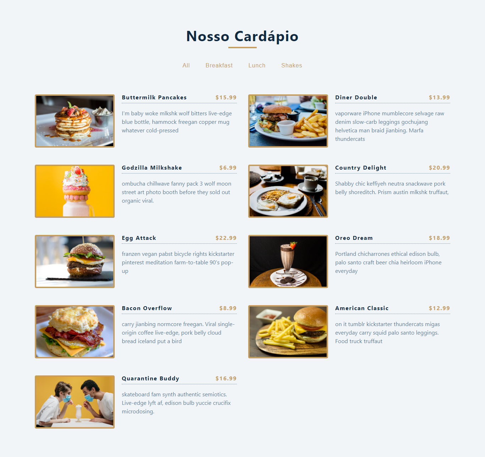

# Cardápio Online - Ótimas escolhas para matar a fome 😋😋

Um cardápio online com escolhas variadas, tendo um filtro próprio para facilitar a escolha.

## Tabela de conteúdos

- [Visão Geral](#visao-geral)
  - [O desafio](#o-desafio)
  - [Screenshot](#screenshot)
  - [Links](#links)
- [Meu processo](#meu-processo)
  - [Tecnologias](#tecnologias)
  - [Oque eu aprendi](#oque-eu-aprendi)
  - [Desenvolvimento Continuo](#development-continuo)
  - [Recursos Úteis](#recursos-uteis)
- [Autor](#autor)
- [Reconhecimentos](#reconhecimentos)


## Visão Geral

### O desafio

O usuário que acessa o cardápio deve ser capaz de:
- Filtrar os itens de acordo com as categorias
- Ver as esolhas de lanches/bebidas
- Ver o preço
- Ver a descrição e o preço
- Ver a foto do lanche/bebida
- Voltar para todas as categorias caso queira.

### Screenshot



### Links

- Live Site URL: [Comente Agora Web](https://julio-henrique-cardapio-online.netlify.app/)


## Meu processo

### Tecnologias

- [React](https://reactjs.org/) - JS lib

### Oque eu aprendi

Esse projeto foi muito bom para solidificar os meus conhecimentos e para trazer à luz algumas dificuldades que eu tinha.

A começar pela listagem de itens, foi bem fácil e consegui fazer com muita tranquilidade. 
Uma coisa que eu gosto de fazer quando vou fazer a listagem dos itens do array é fazer a desustruturação de forma direta, porque assim evita de ficar com o cansativo `item.algumValor`
Ex:
```jsx
    const showCategories = categories.map((item, index) => {})
```

E aprendi que fica bem melhor deixar toda a parte de funcionalidade fora da renderização, fica bem melhor de ler
ex:
```jsx
export const Categories = ({ categories, filterItems }) => {
    const showCategories = categories.map((item, index) => {
        return (
            <button 
                type="button"
                className="filter-btn"
                key={index}
                onClick={() => filterItems(item)}
            >
                {item}
            </button>
        )
    })

    return (
        <div className="btn-container">
            {showCategories}
        </div>
    )
}
```

Eu gostei muito de como eu 'componentizei' a aplicação dividindo em partes e ficando bem mais profissional. Assim cada um cuida do que é seu dever e não fica só 1 App.jsx gigante. 

E percebi que o meu código tem ficado melhor com pequenas mudanças como, colocar o `return` na mesma linha do `if` se o `return` for pequeno
Ex: 
```jsx
function filterItems(categoriesParam) {
    if (categoriesParam === 'all') return setMenuItems(data)

    const filteredCategory = data.filter(item => item.category === categoriesParam)
    
    setMenuItems(filteredCategory)
    return categoriesParam
  }
```
Olha como ficou bem melhor :D


### Desenvolvimento Continuo

Não vou negar que esse processo parecia MUITO MAIS DIFICIL quando eu peguei para fazer ele, realmente pensava que seria um grande desafio.
Mas as minhas habilidades estavam á altura 😁.

**Com isso concluo que os meus fundamentos de ReactSJ estão bem sólidos** e já posso partir para novos mares. 
Typescript ou NextJS? Ainda estou decidindo, provavelmente eu vou primeiro com typescript

## Autor

- Linkedin - [Julio Henrique](https://www.linkedin.com/in/julio-h/)
- Email - juliohjesus@gmail.com
